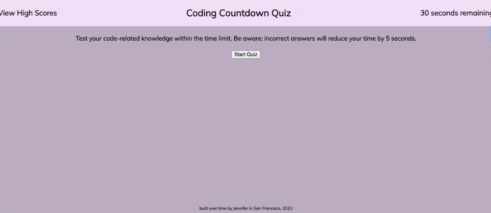

# timed-quiz
## UCB Bootcamp Module 4 Homework Challenge
This is my submission for the UCB Bootcamp Module 4 Homework Challenge. This submission is a timed quiz that uses javascript to function. The user clicks a start button and is presented with the first question. The user will then answer the question and will be awarded a point or have time deducted depending on the user's answer. A new question will appear once an answer is selected. The quiz will end once the timer runs out or when the user has answered all of the questions, whichever occurs first. The user can save their score under their intials and visit a score page to view the saved scores.

## Deployed page
https://jmariemo.github.io/timed-quiz/

## GIF of page

